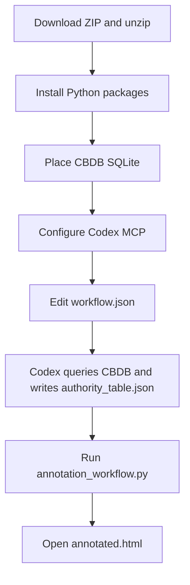

# CBDB MCP Server for Codex

This project provides a local CBDB MCP server and a small annotation workflow for Codex. Codex can query a user-provided CBDB SQLite database through MCP tools, build a task-specific authority table, and generate a browser-readable annotated HTML file.

Demo: https://projects.cclin.cc/cbdb-mcp-server-codex

Detailed introduction: https://cclin.cc/?p=5341

Traditional Chinese README: [README_zh-TW.md](README_zh-TW.md)

The published demo page is generated from `demo/index.html` and deployed to GitHub Pages.

## Features

- Starts a local CBDB MCP server with `FastMCP`.
- Searches CBDB people, places, offices, and reign periods.
- Uses CBDB convenience views when available, with fallback queries against base tables.
- Uses `config/workflow.json` to configure the input text and output paths.
- Splits the input text into chapters and paragraphs.
- Generates an annotated HTML page from `authority_table.json`.
- The HTML page includes chapter navigation, entity highlighting, CBDB detail panels, and Leaflet map markers for places with coordinates.

## Workflow



## Download and Installation

Download ZIP is the recommended path for users who do not work with Git:

1. Open `https://github.com/cclintw/cbdb-mcp-server-codex`.
2. Click `Code` -> `Download ZIP`.
3. Unzip the project into your Codex project folder.
4. Open the folder in Codex.

Then install the Python dependency:

```bash
cd cbdb-mcp-server-codex

python -m venv .venv
source .venv/bin/activate
pip install -r requirements.txt
```

Git users may use `git clone` instead.

## Prepare CBDB SQLite

Download CBDB SQLite and place it at:

```text
data/cbdb/cbdb.sqlite
```

If your database file uses a different name or location, update `CBDB_SQLITE_PATH` in the MCP configuration.

## Configure Codex MCP

Example configuration:

```text
config/codex-mcp-example.json
```

```json
{
  "mcpServers": {
    "cbdb": {
      "command": "python",
      "args": ["mcp_server/server.py"],
      "env": {
        "CBDB_SQLITE_PATH": "data/cbdb/cbdb.sqlite"
      }
    }
  }
}
```

After opening this project folder in Codex, add the MCP server using the configuration above. If you are using the virtual environment, you may set `command` to `.venv/bin/python`.

After the MCP server is configured, ask Codex to call:

```text
inspect_schema()
```

This verifies that SQLite is readable and reports the available CBDB tables and views.

## MCP Tools

| Tool | Description |
|---|---|
| `inspect_schema()` | Returns tables, views, columns, and key CBDB object availability |
| `search_person(name, limit=10)` | Searches people by names and alternate names |
| `search_place(name, limit=10)` | Searches places and coordinates |
| `search_office(name, limit=10)` | Searches office titles, pinyin, and translations |
| `search_reign(name, limit=10)` | Searches reign periods |
| `resolve_entity(name, entity_type, limit=10)` | Searches by type; `entity_type=auto` queries people, places, offices, then reign periods |

## Configure the Text Workflow

Default workflow configuration:

```text
config/workflow.json
```

```json
{
  "input_text": "data/input/sample-1.txt",
  "output_dir": "data/output",
  "authority_table": "data/output/authority_table.json",
  "html_output": "data/output/annotated.html",
  "page_title": "CBDB MCP Annotation Demo"
}
```

To use your own text, place it under `data/input/` and update `input_text`.

Supported chapter heading patterns include:

- `第一章`
- `第一回`
- `卷一`
- `卷上`
- `# Title`
- `## Title`

## Authority Table

After Codex queries CBDB through MCP, write confirmed entities to:

```text
data/output/authority_table.json
```

Example:

```json
[
  {
    "authority_id": "auth_000001",
    "entity_text": "蘇子瞻",
    "entity_type": "person",
    "canonical_name": "蘇軾",
    "source": "CBDB",
    "source_id": "1234",
    "source_url": "https://cbdb.fas.harvard.edu/cbdbapi/person?id=1234",
    "note": "Identified by Codex as a person candidate and matched through CBDB MCP"
  }
]
```

For place entities, include `x_coord` and `y_coord` when available. The generated HTML will display a Leaflet marker.

## Generate HTML

Run the workflow once to generate chapter and paragraph files:

```bash
python annotation_workflow.py --config config/workflow.json
```

Outputs:

```text
data/output/chapters.json
data/output/paragraphs.json
data/output/authority_table.json
data/output/annotated.html
```

Open `data/output/annotated.html` in a browser to view the result.

On the first run, if `authority_table.json` does not exist, the script creates an empty one and writes chapter, paragraph, and unannotated HTML outputs. After Codex updates the authority table, run the same command again to refresh the annotated HTML.

## Example Codex Task

After configuring MCP and running `annotation_workflow.py` once, paste a task like this into Codex:

```text
Read the input_text specified in config/workflow.json.
Use data/output/chapters.json and data/output/paragraphs.json as references.
Identify candidate person, place, office, and reign entities that are suitable for CBDB lookup.
Use the cbdb MCP tools: search_person, search_place, search_office, and search_reign.
Write confirmed matches to data/output/authority_table.json.
When finished, run python annotation_workflow.py --config config/workflow.json.
```

## Project Structure

```text
cbdb-mcp-server-codex/
├── .github/
│   └── workflows/
│       └── pages.yml
├── README.md
├── README_zh-TW.md
├── requirements.txt
├── annotation_workflow.py
├── config/
│   ├── cbdb_schema_notes.json
│   ├── codex-mcp-example.json
│   └── workflow.json
├── data/
│   ├── cbdb/
│   │   └── README.md
│   └── input/
│       └── sample-1.txt
├── demo/
│   ├── .nojekyll
│   └── index.html
└── mcp_server/
    ├── cbdb_sqlite.py
    └── server.py
```

## Data Source

CBDB SQLite should be obtained, used, and cited according to CBDB's official terms and citation guidelines.

Recommended citation:

```text
Harvard University, Academia Sinica, and Peking University, China Biographical Database (CBDB), https://projects.iq.harvard.edu/cbdb.
```

CBDB citation guide: https://projects.iq.harvard.edu/cbdb/how-cite-cbdb

This repository provides the MCP server and demonstration workflow code.
