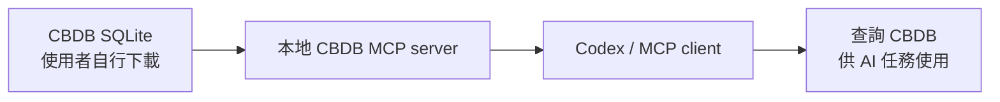

# 自建 CBDB MCP Server

本專案示範如何在本機自建一個 CBDB MCP server，讓 Codex 或其他支援 MCP 的 AI 工具能夠查詢使用者自行下載的 CBDB SQLite。

CBDB 目前提供 API 與可下載資料，但尚未提供官方 MCP server。本專案因此提供一個本地實作：使用者把 CBDB SQLite 放到指定位置後，即可透過 MCP tools 查詢人物、地名、職官與年號。

本專案不重新發布 CBDB SQLite，也不建立自有大型權威資料庫。

## 專案用途

本 repo 主要提供：

- CBDB MCP server 程式
- Codex MCP client 設定範例
- 一份合成示範文本 `sample-1.txt`，可作為 Codex 標註任務測試材料

專案重點是「如何讓 AI 工具透過 MCP 使用 CBDB」。本 repo 不預設使用者要處理哪一種文本，也不提供固定的文本處理 pipeline。

## 為什麼需要下載 CBDB SQLite

如果 CBDB 未來提供官方 MCP server，使用者只需要套用官方 MCP client 設定，即可直接讓 Codex 連到 CBDB 官方服務。

但在目前情況下，CBDB 尚未提供官方 MCP server。為了示範 MCP 在史學資料庫中的應用，本專案使用 CBDB 可下載 SQLite 的特性，在本機自建 MCP server。



## 功能

MCP server 使用 `FastMCP`，提供以下 tools：

| Tool | 功能 |
|---|---|
| `inspect_schema()` | 檢查 SQLite tables、views、columns |
| `search_person(name, limit=10)` | 查詢 CBDB 人物 |
| `search_place(name, limit=10)` | 查詢 CBDB 地名 |
| `search_office(name, limit=10)` | 查詢 CBDB 職官 |
| `search_reign(name, limit=10)` | 查詢 CBDB 年號 |
| `resolve_entity(name, entity_type, limit=10)` | 依類型或 auto 模式解析實體 |

查詢層會優先使用 CBDB convenience views；若 view 不存在，會 fallback 到原始表。

## 安裝

建議使用 Python 3.11 以上。

```bash
python -m venv .venv
source .venv/bin/activate
pip install -r requirements.txt
```

## 準備 CBDB SQLite

請依 CBDB 官方 `cbdb_sqlite` repo 下載 SQLite，並放在：

```text
data/cbdb/cbdb.sqlite
```

本專案不內附 CBDB SQLite。`data/cbdb/README.md` 有放置說明。

## 啟動 MCP server

```bash
CBDB_SQLITE_PATH=data/cbdb/cbdb.sqlite python mcp_server/server.py
```

如果 SQLite 不存在，`inspect_schema()` 會回傳 `sqlite_exists: false`，查詢 tools 會回傳錯誤訊息。

## Codex MCP 設定

Codex client 設定範例：

```json
{
  "mcpServers": {
    "cbdb": {
      "command": "python",
      "args": ["mcp_server/server.py"],
      "env": {
        "CBDB_SQLITE_PATH": "data/cbdb/cbdb.sqlite"
      }
    }
  }
}
```

範例檔位於：

```text
config/codex-mcp-example.json
```

請依實際環境調整 `command` 的 Python 路徑。

## 示範文本

本 repo 附一份合成示範文本：

```text
data/input/sample-1.txt
```

此文本經亂數處理，目的只是展示 CBDB MCP server 的查詢與標註效果，不作為可靠文本版本。

使用者可以改用自己的文本。MCP server 不讀取或改寫文本；它只提供 CBDB 查詢 tools，讓 Codex 或其他 MCP client 在任務中自行決定如何使用查詢結果。

## Codex 使用概念

本 repo 不把一次性的 Codex prompt 或本機任務備忘錄納入版本控制。使用 Codex 進行標註或研究輔助時，核心概念是：

1. 使用者準備自己的文本或使用 `data/input/sample-1.txt`。
2. Codex 根據任務需求判斷需要查詢的人物、地名、職官或年號。
3. Codex 透過 MCP tools 查詢本機 CBDB SQLite。
4. Codex 將查詢結果用於註解、校對、候選比對、研究筆記或其他輸出。

## 專案結構

```text
cbdb-mcp-server-codex/
├── README.md
├── requirements.txt
├── config/
│   ├── cbdb_schema_notes.json
│   └── codex-mcp-example.json
├── data/
│   ├── cbdb/
│   │   └── README.md
│   └── input/
│       └── sample-1.txt
├── mcp_server/
│   ├── cbdb_sqlite.py
│   └── server.py
```

`data/output/`、`doc/`、`prompts/`、`src/`、`templates/`、`*.html` 與下載後的 CBDB SQLite 都屬本機工作檔或產物，不納入 repo。

## 不包含的功能

本專案刻意不實作：

- CKIP
- jieba
- 斷詞
- 分句
- 自建詞表
- 規則表
- ontology pipeline
- OpenAI API 呼叫
- 額外 LLM API client

AI 判斷由 Codex 或其他 MCP client 完成；CBDB 查詢由本專案的 MCP server 完成。

## 資料與授權聲明

CBDB SQLite 與相關資料權利屬其原資料提供者與維護者。使用者應依 CBDB 官方授權與引用規範自行下載、使用與引用。

本專案不重新發布 CBDB SQLite，不把 CBDB SQLite 放入 repo，也不建立大型衍生資料庫。
