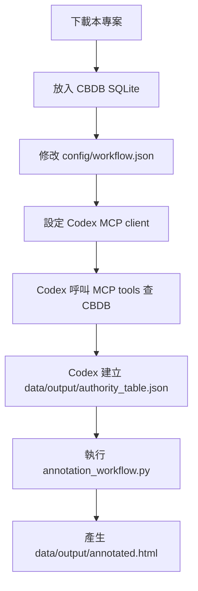

# 自建 CBDB MCP Server for Codex

本專案提供一個本機 CBDB MCP server，讓 Codex 可以查詢使用者自行下載的 CBDB SQLite，並把查詢結果用在歷史文本標註任務中。

CBDB 目前提供 API 與可下載資料，但尚未提供官方 MCP server。因此本專案示範：使用者在本機放置 CBDB SQLite，透過本專案啟動 MCP server，再讓 Codex 以 MCP tools 查詢 CBDB。

本專案不重新發布 CBDB SQLite，不建立大型衍生資料庫，也不內建 OpenAI API client。

## Repo 內容

本 repo 只保留完成流程需要的最小檔案：

- `mcp_server/`：CBDB MCP server。
- `config/codex-mcp-example.json`：Codex MCP client 設定範例。
- `config/workflow.json`：標註輸出流程設定檔。
- `annotation_workflow.py`：分章、分段、依 authority table 產生 HTML。
- `data/input/sample-1.txt`：合成示範文本，可替換成自己的文本。
- `data/cbdb/README.md`：CBDB SQLite 放置說明。

## 整體流程



最短操作順序：

1. 下載 repo，安裝 Python 套件。
2. 把 CBDB SQLite 放到 `data/cbdb/cbdb.sqlite`。
3. 把要讀的文本放到 `data/input/`。
4. 修改 `config/workflow.json` 的 `input_text`。
5. 在 Codex 中設定 `config/codex-mcp-example.json` 這個 MCP server。
6. 請 Codex 讀取文本並呼叫 CBDB MCP tools，產生 `data/output/authority_table.json`。
7. 執行 `python annotation_workflow.py --config config/workflow.json`。
8. 開啟 `data/output/annotated.html`。

`annotation_workflow.py` 可以重複執行。第一次執行時，即使還沒有 authority table，也會先建立章節與段落檔；Codex 補完 `authority_table.json` 後再執行一次，即可更新 HTML 標註結果。

## 安裝

建議使用 Python 3.11 以上。

```bash
git clone https://github.com/cclintw/cbdb-mcp-server-codex.git
cd cbdb-mcp-server-codex

python -m venv .venv
source .venv/bin/activate
pip install -r requirements.txt
```

`requirements.txt` 只安裝 MCP server 需要的套件。`annotation_workflow.py` 使用 Python 標準函式庫。

## 準備 CBDB SQLite

請使用者自行從 CBDB 官方來源下載 SQLite，並放在：

```text
data/cbdb/cbdb.sqlite
```

本專案不內附 CBDB SQLite。若需要 CBDB convenience views，可依 CBDB 官方 `cbdb_sqlite` repo 的 `scripts/create_views.sh` 建立 views；若需要 `ADDRESSES` 表，可依官方 `scripts/create_addresses_table.py` 建立。

## 準備文本

預設文本是：

```text
data/input/sample-1.txt
```

如果要使用自己的文本，放入 `data/input/`，例如：

```text
data/input/my-text.txt
```

然後修改 `config/workflow.json`：

```json
{
  "input_text": "data/input/my-text.txt",
  "output_dir": "data/output",
  "authority_table": "data/output/authority_table.json",
  "html_output": "data/output/annotated.html",
  "page_title": "CBDB MCP Annotation Demo"
}
```

章節偵測支援常見格式：

- `第一章`
- `第一回`
- `卷一`
- `卷上`
- `# 標題`
- `## 標題`

段落只依空行或自然換行整理，不做斷詞、不做分句。

## 設定 Codex MCP

Codex MCP client 設定範例位於：

```text
config/codex-mcp-example.json
```

內容如下：

```json
{
  "mcpServers": {
    "cbdb": {
      "command": "python",
      "args": ["mcp_server/server.py"],
      "env": {
        "CBDB_SQLITE_PATH": "data/cbdb/cbdb.sqlite"
      }
    }
  }
}
```

在 Codex 中開啟本專案資料夾後，依 Codex 的 MCP 設定方式加入上述 server。若你的 Python 不在 `python`，請把 `command` 改成實際路徑，例如 `.venv/bin/python`。

可先要求 Codex 呼叫：

```text
inspect_schema()
```

確認 `sqlite_exists` 為 `true`，並檢查 `BIOG_MAIN`、`ADDR_CODES`、`OFFICE_CODES`、`NIAN_HAO` 等表是否存在。

## MCP Tools

MCP server 使用 `FastMCP`，提供：

| Tool | 功能 |
|---|---|
| `inspect_schema()` | 檢查 SQLite tables、views、columns |
| `search_person(name, limit=10)` | 查詢 CBDB 人物 |
| `search_place(name, limit=10)` | 查詢 CBDB 地名 |
| `search_office(name, limit=10)` | 查詢 CBDB 職官 |
| `search_reign(name, limit=10)` | 查詢 CBDB 年號 |
| `resolve_entity(name, entity_type, limit=10)` | 依類型或 `auto` 模式解析實體 |

查詢層會優先使用 CBDB convenience views；若 view 不存在，會 fallback 到原始表。

## 建立 authority table

Codex 透過 MCP 查詢 CBDB 後，請把確認要標註的實體寫入：

```text
data/output/authority_table.json
```

格式如下：

```json
[
  {
    "authority_id": "auth_000001",
    "entity_text": "蘇子瞻",
    "entity_type": "person",
    "canonical_name": "蘇軾",
    "source": "CBDB",
    "source_id": "1234",
    "source_url": "https://cbdb.fas.harvard.edu/cbdbapi/person?id=1234",
    "note": "由 Codex 判斷為人物候選，經 CBDB MCP 查詢比對"
  }
]
```

可用欄位包含：

- `entity_text`：文本中要標註的原文。
- `entity_type`：`person`、`place`、`office`、`reign`。
- `canonical_name`：CBDB 權威名稱。
- `source_id`：CBDB ID。
- `source_url`：CBDB 參考來源。
- `x_coord`、`y_coord`：地名座標，若 CBDB 查詢結果有座標，HTML 會以 Leaflet 顯示 marker。

## 產生 HTML

建立或更新 `authority_table.json` 後，執行：

```bash
python annotation_workflow.py --config config/workflow.json
```

輸出檔案：

```text
data/output/chapters.json
data/output/paragraphs.json
data/output/authority_table.json
data/output/annotated.html
```

直接用瀏覽器開啟：

```text
data/output/annotated.html
```

HTML 會包含：

- 左側章節列表
- 中央文本與高亮標註
- 右側 CBDB 標註內容
- authority list
- 地名座標 marker，使用 Leaflet + OpenStreetMap

## 一個可執行的 Codex 任務描述

在 Codex 中可使用類似以下任務：

```text
請讀取 config/workflow.json 指定的 input_text。
請判斷文本中適合查詢 CBDB 的 person、place、office、reign 候選。
請使用 cbdb MCP tools 查詢：
- search_person
- search_place
- search_office
- search_reign
請將確認結果寫入 data/output/authority_table.json。
完成後執行 python annotation_workflow.py --config config/workflow.json。
```

## 專案結構

```text
cbdb-mcp-server-codex/
├── README.md
├── requirements.txt
├── annotation_workflow.py
├── config/
│   ├── cbdb_schema_notes.json
│   ├── codex-mcp-example.json
│   └── workflow.json
├── data/
│   ├── cbdb/
│   │   └── README.md
│   └── input/
│       └── sample-1.txt
└── mcp_server/
    ├── cbdb_sqlite.py
    └── server.py
```

`data/output/`、下載後的 CBDB SQLite、HTML 輸出、臨時 prompt 與本機工作檔不納入 repo。

## 不包含的功能

本專案刻意不實作：

- CKIP
- jieba
- 斷詞
- 分句
- 自建詞表
- 規則表
- ontology pipeline
- OpenAI API 呼叫
- 額外 LLM API client

AI 判斷由 Codex 或其他 MCP client 完成；CBDB 查詢由本專案的 MCP server 完成；`annotation_workflow.py` 只負責分章、分段與 HTML 輸出。

## 資料與授權聲明

CBDB SQLite 與相關資料權利屬其原資料提供者與維護者。使用者應依 CBDB 官方授權與引用規範自行下載、使用與引用。

本專案不重新發布 CBDB SQLite，不把 CBDB SQLite 放入 repo，也不建立大型衍生資料庫。
