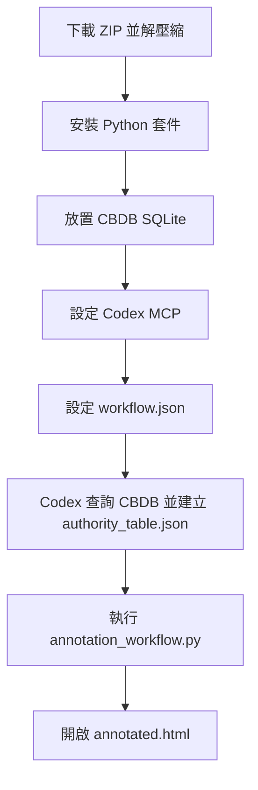

# CBDB MCP Server for Codex

本專案提供一個本機 CBDB MCP server 與一個簡單的文本標註輸出流程。使用者可以在 Codex 中透過 MCP tools 查詢 CBDB SQLite，建立本次任務所需的 authority table，並輸出可直接瀏覽的 annotated HTML。

Demo: https://projects.cclin.cc/cbdb-mcp-server-codex

展示頁來源位於 `demo/index.html`，並由 GitHub Actions 部署到 GitHub Pages。

## 功能概覽

- 以 `FastMCP` 啟動本機 CBDB MCP server。
- 查詢 CBDB 人物、地名、職官、年號。
- 支援 CBDB convenience views，並在 view 不存在時 fallback 至原始表。
- 透過 `config/workflow.json` 指定輸入文本與輸出位置。
- 將文本分章、分段，並依 `authority_table.json` 產生 HTML 標註頁。
- HTML 內含章節導覽、實體高亮、CBDB 詳情欄與 Leaflet 地圖標記。

## 專案流程



## 下載與安裝

建議使用 Download ZIP：

1. 開啟專案頁面：`https://github.com/cclintw/cbdb-mcp-server-codex`
2. 點選 `Code` → `Download ZIP`
3. 解壓縮到自己的 Codex 專案資料夾
4. 在 Codex 中開啟該資料夾

```bash
cd cbdb-mcp-server-codex

python -m venv .venv
source .venv/bin/activate
pip install -r requirements.txt
```

如果熟悉 Git，也可以改用 `git clone` 取得專案。

## 準備 CBDB SQLite

下載 CBDB SQLite 後，放在：

```text
data/cbdb/cbdb.sqlite
```

若已使用其他檔名或位置，可在 MCP 設定中的 `CBDB_SQLITE_PATH` 指向實際路徑。

## 設定 Codex MCP

範例設定檔：

```text
config/codex-mcp-example.json
```

內容：

```json
{
  "mcpServers": {
    "cbdb": {
      "command": "python",
      "args": ["mcp_server/server.py"],
      "env": {
        "CBDB_SQLITE_PATH": "data/cbdb/cbdb.sqlite"
      }
    }
  }
}
```

在 Codex 中開啟本專案資料夾後，依 Codex 的 MCP 設定方式加入上述 server。若使用虛擬環境，也可以把 `command` 改為 `.venv/bin/python`。

設定完成後，可先請 Codex 呼叫：

```text
inspect_schema()
```

確認 SQLite 可讀取，並檢查 CBDB tables / views。

## MCP Tools

| Tool | 說明 |
|---|---|
| `inspect_schema()` | 回傳 tables、views、columns 與主要 CBDB 物件存在狀態 |
| `search_person(name, limit=10)` | 查詢人物姓名與別名 |
| `search_place(name, limit=10)` | 查詢地名與座標 |
| `search_office(name, limit=10)` | 查詢職官名稱、拼音與英譯 |
| `search_reign(name, limit=10)` | 查詢年號 |
| `resolve_entity(name, entity_type, limit=10)` | 依指定類型查詢；`entity_type=auto` 時依序查人物、地名、職官、年號 |

## 設定文本流程

預設 workflow：

```text
config/workflow.json
```

```json
{
  "input_text": "data/input/sample-1.txt",
  "output_dir": "data/output",
  "authority_table": "data/output/authority_table.json",
  "html_output": "data/output/annotated.html",
  "page_title": "CBDB MCP Annotation Demo"
}
```

若要改用自己的文本，將檔案放入 `data/input/`，並修改 `input_text`。

支援的章節標題格式包括：

- `第一章`
- `第一回`
- `卷一`
- `卷上`
- `# 標題`
- `## 標題`

## 建立 Authority Table

Codex 透過 MCP tools 查詢 CBDB 後，將確認的實體寫入：

```text
data/output/authority_table.json
```

格式範例：

```json
[
  {
    "authority_id": "auth_000001",
    "entity_text": "蘇子瞻",
    "entity_type": "person",
    "canonical_name": "蘇軾",
    "source": "CBDB",
    "source_id": "1234",
    "source_url": "https://cbdb.fas.harvard.edu/cbdbapi/person?id=1234",
    "note": "由 Codex 判斷為人物候選，經 CBDB MCP 查詢比對"
  }
]
```

地名若包含 `x_coord`、`y_coord`，HTML 會顯示 Leaflet marker。

## 產生 HTML

建議先執行一次 workflow，產生章節與段落檔：

```bash
python annotation_workflow.py --config config/workflow.json
```

輸出：

```text
data/output/chapters.json
data/output/paragraphs.json
data/output/authority_table.json
data/output/annotated.html
```

開啟 `data/output/annotated.html` 即可瀏覽標註結果。

第一次執行時，如果 `authority_table.json` 尚不存在，程式會先建立空檔案並輸出章節、段落與未標註 HTML。完成 CBDB 查詢並更新 authority table 後，再執行一次即可更新標註。

## Codex 任務範例

完成 MCP 設定並先執行一次 `annotation_workflow.py` 後，可在 Codex 中貼上：

```text
請讀取 config/workflow.json 指定的 input_text。
請參考 data/output/chapters.json 與 data/output/paragraphs.json。
請判斷文本中適合查詢 CBDB 的 person、place、office、reign 候選實體。
請使用 cbdb MCP tools 查詢 search_person、search_place、search_office、search_reign。
請將確認結果寫入 data/output/authority_table.json。
完成後執行 python annotation_workflow.py --config config/workflow.json。
```

## 專案結構

```text
cbdb-mcp-server-codex/
├── .github/
│   └── workflows/
│       └── pages.yml
├── README.md
├── requirements.txt
├── annotation_workflow.py
├── config/
│   ├── cbdb_schema_notes.json
│   ├── codex-mcp-example.json
│   └── workflow.json
├── data/
│   ├── cbdb/
│   │   └── README.md
│   └── input/
│       └── sample-1.txt
├── demo/
│   └── index.html
└── mcp_server/
    ├── cbdb_sqlite.py
    └── server.py
```

## 資料來源

```text
Harvard University, Academia Sinica, and Peking University, China Biographical Database (CBDB), https://projects.iq.harvard.edu/cbdb.
```

本 repo 提供 MCP server 與示範 workflow 程式碼。
