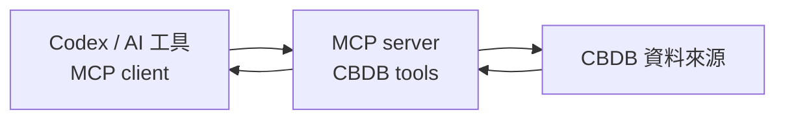
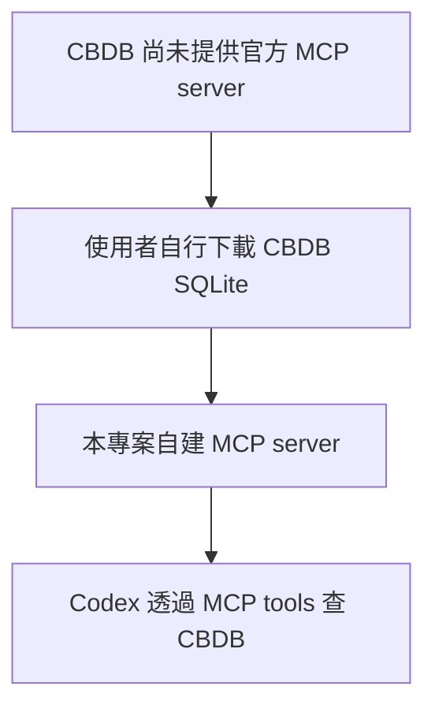
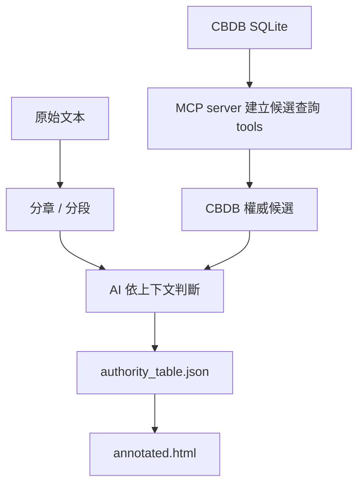

# AI 與史學研究：MCP 如何把 CBDB 接入文本標註流程

## 什麼是 MCP

MCP 是 Model Context Protocol 的縮寫。它可以理解為一套讓 AI 工具使用外部資料與功能的標準協定。

如果用比較白話的方式說，API 是給程式呼叫的介面，MCP 則是把資料庫、API 或本地工具包裝成 AI 可以使用的「工具箱」。AI 不必知道資料庫裡有幾十張表，也不必自己寫 SQL；它只需要知道 MCP server 提供了哪些 tools，例如查人名、查地名、查職官、查年號。

這件事對史學研究很重要。史學資料庫通常不是單純的關鍵字表，而是包含人物、別名、籍貫、任官、年號、地名、座標、出處等複雜資料。AI 可以協助判斷文本語境，但不應憑記憶決定 CBDB ID，也不應自己編造權威資料。MCP 的價值，就是讓 AI 在標註時可以接到一個可追溯的資料來源。



## 為什麼本專案要下載 CBDB SQLite

讀者可能會問：既然 CBDB 已經有 API，為什麼這個專案還要下載 SQLite？

原因很直接：目前 CBDB 提供 API，但沒有提供可直接給 Codex 使用的官方 MCP server。也就是說，使用者不能只拿一份 CBDB 官方 MCP 設定檔，貼到 Codex 裡就開始使用。為了讓 AI 能用 MCP 查 CBDB，本專案必須在本地自建一個 MCP server。

而自建 MCP server 需要資料來源。CBDB 剛好是一個很適合拿來示範的例子，因為它除了提供 API，也提供可下載的 SQLite 資料庫。使用者可以把 SQLite 放在本機，然後由本專案的 MCP server 查詢它。



如果將來 CBDB 官方提供 MCP server，情況就會不同。使用者理論上不需要下載 SQLite，也不需要本專案自建 server；只要依 CBDB 官方提供的 MCP client 設定，讓 Codex 連到官方 MCP server 即可。

可以把現在與未來的差別看成這樣：

| 情境 | 使用者需要做什麼 | 資料來源 | MCP server 由誰提供 |
|---|---|---|---|
| 目前本專案 | 下載 CBDB SQLite，啟動本地 MCP server | 本地 SQLite | 本專案自建 |
| 若 CBDB 官方提供 MCP | 套用官方 MCP client 設定 | 官方服務或官方資料庫 | CBDB 官方 |

這也是為什麼本專案選 CBDB 作為例子：CBDB 資料庫可以下載，所以即使官方還沒有 MCP server，研究者仍可以在本地建立一個可用的 MCP 示範環境。

## MCP server 與 MCP client

MCP 至少包含兩個角色：MCP server 與 MCP client。

| 角色 | 說明 | 本專案例子 |
|---|---|---|
| MCP server | 定義 AI 可以呼叫哪些 tools，以及每個 tool 如何查資料 | `mcp_server/server.py` |
| MCP client | 連接 MCP server，讓 AI 可以使用這些 tools | Codex 的 MCP 設定 |
| 資料來源 | MCP server 實際查詢的資料庫或服務 | `data/cbdb/cbdb.sqlite` |

MCP server 通常應由資料提供者、資料維護者，或熟悉資料結構的人來設計。原因很簡單：只有資料提供者最清楚哪些表可以查、哪些欄位可靠、哪些 view 應優先使用、哪些結果需要加註限制。

以 CBDB 這類資料庫來說，MCP server 不只是把 SQL 暴露出去，而是應該提供研究者真正需要的工具，例如：

- `search_person(name)`
- `search_place(name)`
- `search_office(name)`
- `search_reign(name)`
- `resolve_entity(name, entity_type)`
- `inspect_schema()`

這些 tools 背後可以處理 view fallback、欄位缺失、SQLite 不存在、查無結果、中文欄位為空等問題。AI 不需要知道 CBDB 內部表結構的每個細節，只需要呼叫定義好的工具。

MCP client 則是 AI 工具端的設定。以 Codex 為例，client 設定大致是一個 JSON，告訴 Codex 要如何啟動或連接 MCP server。

```json
{
  "mcpServers": {
    "cbdb": {
      "command": "python",
      "args": ["mcp_server/server.py"],
      "env": {
        "CBDB_SQLITE_PATH": "data/cbdb/cbdb.sqlite"
      }
    }
  }
}
```

如果是官方遠端 MCP server，client 設定可能會長得不一樣，可能指向遠端服務、需要 token，或使用不同 transport。重點是：MCP client 設定告訴 Codex「去哪裡找這個工具箱」。

在理想情況下，資料庫提供者不只提供 API 文件，也會提供：

1. MCP server 或可連線的 MCP endpoint。
2. MCP tools 的說明。
3. 給 Codex、Claude Desktop 等工具使用的 MCP client JSON 範例。

但 MCP 是近一兩年才快速普及的應用，大多數史學資料庫還沒有跟上這個潮流。許多資料庫仍停留在 API 串接階段：有 REST API、有下載檔、有查詢頁，但還沒有為 AI 工具準備 MCP server。

## MCP 和 API 有何不同

API 是程式對程式的介面。開發者通常先寫好流程，再用 API 查詢資料。

MCP 則是讓 AI 可以使用工具的一層協定。它不是取代 API，而是把 API、資料庫、本地程式包裝成 AI 可以理解與呼叫的 tools。

| 比較項目 | 一般 API | MCP |
|---|---|---|
| 使用者 | 程式開發者 | AI 工具與 agent |
| 流程 | 開發者預先寫死 | AI 可依任務呼叫工具 |
| 資料提供方式 | endpoint 或函式 | tools + schema + client 設定 |
| 適合任務 | 固定查詢、固定頁面 | 需要 AI 判斷、消歧、組合工具的任務 |
| CBDB 例子 | 用 person API 查人物 | Codex 呼叫 `search_person`、`search_place` 等 tools |

如果只是做一個網站，讓使用者輸入「王安石」後顯示 CBDB API 結果，一般 API 就足夠。

如果任務是「請 AI 閱讀一段歷史文本，結合 CBDB 權威資料判斷哪些詞應該被標註」，MCP 就比較合適。

## 什麼情況下使用 MCP

MCP 不應被濫用。沒有 AI 參與時，一般 API、Python 函式或 SQL 查詢通常比較直接。

適合一般 API 的情況：

- 固定欄位查詢。
- 固定輸入與輸出。
- 不需要 AI 判斷上下文。
- 只要把資料顯示在網頁上。

適合 MCP 的情況：

- AI 需要在標註過程中查權威資料。
- AI 需要根據上下文決定某個詞是人名、地名、職官還是年號。
- AI 需要在多個工具之間選擇，例如先查人名，再查別名，再查地名。
- 資料庫很複雜，不希望 AI 直接亂寫 SQL。

一句話區分：

> 沒用 AI 判斷時，用 API；需要 AI 在研究流程中使用資料庫時，用 MCP。

## CBDB 應該只是被動查詢嗎

不應該。

如果流程是「AI 先猜候選，猜到什麼才去 CBDB 查什麼」，會有一個問題：AI 沒猜到的實體，CBDB 完全沒有機會參與。這會讓召回率受限於 AI 的第一輪判斷。

更好的流程是把 CBDB 當作權威候選來源：



也就是：

1. CBDB 提供可查詢的權威候選。
2. AI 負責判斷候選在文本中是否成立。
3. MCP 查核並補充 CBDB 欄位。
4. 最後產生本次標註用 authority table。

這樣 CBDB 不只是被動查詢端，而是標註流程中的權威資料來源。

## AI 標註和傳統標註的差異

傳統標註工具，例如 MARKUS，通常依賴詞表、規則表、別名表與人工校對。這種方式穩定、可控制，適合嚴謹校勘與大規模重複標註。

AI 標註的優勢在於上下文理解。它可以判斷某個詞在不同語境下的角色，例如「太尉」可能是職官，「洪太尉」在小說語境中可能是稱謂，不一定等於 CBDB 中的某個標準人名。

| 標註方式 | 優點 | 限制 |
|---|---|---|
| 傳統標註 | 可控、可重複、適合校對 | 詞表與規則建置成本高 |
| AI 標註 | 可做語意與上下文判斷 | 需要權威資料查核 |
| AI + MCP + CBDB | 以 CBDB 為權威來源，AI 做消歧 | 仍需人工檢查結果 |

AI 標註不是取代 MARKUS，而是補足傳統流程在候選判斷、上下文消歧上的彈性。

## 本專案做了什麼

GitHub 專案下載：

[https://github.com/cclintw/cbdb-mcp-annotation-demo](https://github.com/cclintw/cbdb-mcp-annotation-demo)

本專案示範：

- 使用者自行下載 CBDB SQLite。
- 本地啟動 CBDB MCP server。
- Codex 作為 MCP client 呼叫 CBDB tools。
- 產生本次標註用的 `authority_table.json`。
- Python 只負責分章、分段與 HTML 標註輸出。

本專案不做：

- CKIP
- jieba
- 斷詞
- 分句
- 自建詞表
- 規則表
- ontology pipeline
- OpenAI API 呼叫
- 額外 LLM API client

重點是測試 MCP 如何接入史學文本標註流程，而不是建立完整 NLP pipeline。

## 專案檔案結構

```text
cbdb-mcp-annotation-demo/
├── mcp_server/
│   ├── server.py
│   └── cbdb_sqlite.py
├── src/
│   ├── main.py
│   ├── split_text.py
│   ├── annotator.py
│   ├── html_exporter.py
│   └── generate_demo_corpus.py
├── data/
│   ├── cbdb/cbdb.sqlite
│   ├── input/sample-1.txt
│   └── output/
│       ├── authority_table.json
│       └── annotated.html
└── config/
    └── codex-mcp-example.json
```

其中 `mcp_server/server.py` 是 MCP server 入口，大致長這樣：

```python
from mcp.server.fastmcp import FastMCP
from cbdb_sqlite import CBDBSQLite

mcp = FastMCP("cbdb-mcp-annotation-demo")
db = CBDBSQLite()

@mcp.tool()
def search_person(name: str, limit: int = 10) -> list[dict]:
    return db.search_person(name, limit)

@mcp.tool()
def search_place(name: str, limit: int = 10) -> list[dict]:
    return db.search_place(name, limit)

if __name__ == "__main__":
    mcp.run()
```

Codex 端的 MCP client 設定則類似：

```json
{
  "mcpServers": {
    "cbdb": {
      "command": "/path/to/python",
      "args": ["mcp_server/server.py"],
      "env": {
        "CBDB_SQLITE_PATH": "data/cbdb/cbdb.sqlite"
      }
    }
  }
}
```

server 定義 tools；client 設定如何啟動 server。

## 執行方式

準備 CBDB SQLite：

```text
data/cbdb/cbdb.sqlite
```

安裝套件：

```bash
pip install -r requirements.txt
```

生成示範文本與 authority table：

```bash
python src/generate_demo_corpus.py
```

產生 HTML：

```bash
python src/main.py --input data/input/sample-1.txt
```

輸出結果：

```text
data/output/annotated.html
```

## authority table 的角色

`authority_table.json` 是 AI 標註與 HTML 輸出之間的中介層。它記錄本次標註使用了哪些 CBDB 實體。

範例：

```json
{
  "authority_id": "auth_000001",
  "entity_text": "樓居明",
  "entity_type": "person",
  "canonical_name": "樓居明",
  "source": "CBDB",
  "source_id": "19946",
  "source_url": "https://cbdb.fas.harvard.edu/cbdbapi/person?id=19946",
  "dynasty": "宋"
}
```

HTML 不需要重新查 CBDB，只要根據 authority table 標註文本。右側欄的「參考來源」則可直接開啟 CBDB 人物 API。

## 成果頁功能

成果頁是：

```text
data/output/annotated.html
```

功能包括：

- 左側章節列表。
- 中央標註文本。
- 上方人物、地點、職官、年號 badge。
- 右側 CBDB 詳情。
- 地點若有座標，使用 Leaflet + OpenStreetMap 顯示 marker。
- 人物若有 `source_url`，可點「參考來源」開啟 CBDB API。


示範頁目前使用 100 筆 CBDB 實體：

| 類型 | 數量 |
|---|---:|
| 人物 | 30 |
| 地名 | 34 |
| 職官 | 20 |
| 年號 | 16 |
| 合計 | 100 |

## 教學上的意義

這個專案可以用來說明三件事。

第一，AI 不應被當成權威資料庫。AI 可以判斷上下文，但人物 ID、地理座標、職官資料應回到 CBDB 這類權威資料來源。

第二，MCP server 應由資料提供者或熟悉資料結構的人設計。它定義 AI 能如何安全、穩定地查資料，而不是讓 AI 直接面對複雜資料庫。

第三，MCP client 設定應由工具或資料提供者提供範例。對使用者來說，最重要的是知道如何把 Codex 接到本地 MCP server。

在史學研究裡，這種架構的價值不是「自動完成所有標註」，而是把 AI 的上下文判斷能力，接到可追溯的權威資料來源上。
